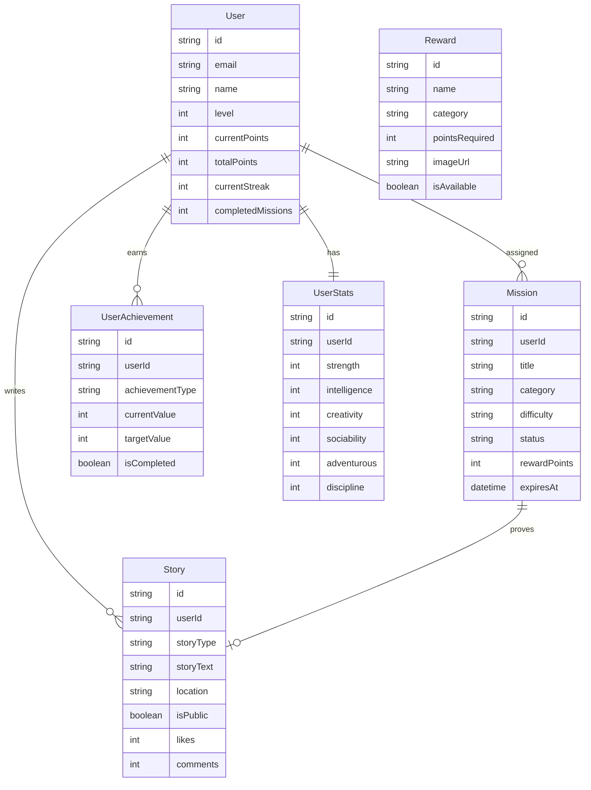

# 🔥 Spark Backend API

> **소셜 게이미피케이션 랜덤 미션 플랫폼**  
> 일상에 새로운 도전과 재미를 더하는 게임화된 미션 서비스

[](https://spring.io/projects/spring-boot)
[](https://kotlinlang.org/)
[](https://www.postgresql.org/)
[](https://openjdk.org/)

## 📋 목차
- [프로젝트 개요](#-프로젝트-개요)
- [핵심 기능](#-핵심-기능)
- [아키텍처](#-아키텍처)
- [기술 스택](#-기술-스택)
- [실행 방법](#-실행-방법)
- [API 문서](#-api-문서)
- [데이터베이스](#-데이터베이스)
- [배포](#-배포)

## 🎯 프로젝트 개요

**Spark**는 사용자들이 랜덤으로 부여된 일일 미션을 수행하고, 그 경험을 스토리로 공유하며 소통하는 **소셜 게이미피케이션 플랫폼**입니다. 

### 🌟 비전
- 일상의 루틴에서 벗어나 새로운 경험과 도전 제공
- 게임적 요소(레벨, 포인트, 업적)로 동기부여 극대화
- 소셜 피드를 통한 커뮤니티 형성 및 상호 격려

### 🎮 게임 메커니즘
- **RPG 시스템**: 레벨업, 능력치, 업적 시스템
- **포인트 경제**: 미션 완료로 포인트 획득, 리워드 교환
- **스트릭 시스템**: 연속 미션 완료로 추가 보상
- **소셜 피드**: 미션 인증 스토리 공유 및 상호작용

## ✨ 핵심 기능

### 🎯 미션 시스템
- **5개 카테고리**: 건강, 창의, 사교, 모험, 학습
- **일일 3개 미션 제한**: 집중도 향상을 위한 제한
- **난이도별 보상**: 쉬움(10점), 보통(20점), 어려움(30점)
- **자동 만료**: 24시간 후 자동 만료

### 👤 사용자 관리
- **50레벨 시스템**: BEGINNER → LEGEND → MYTHIC
- **RPG 능력치**: 체력, 지능, 창의력, 사교성, 모험심, 절제력
- **업적 시스템**: 12종류 업적으로 다양한 목표 제공
- **스트릭 추적**: 연속 미션 완료 일수 기록

### 📱 소셜 기능
- **스토리 공유**: 미션 인증 및 일상 스토리 작성
- **자동 태깅**: AI 기반 컨텐츠 분석으로 관련 태그 자동 생성
- **좋아요 & 댓글**: 소셜 상호작용 기능
- **피드 시스템**: 커서 기반 무한 스크롤

### 🎁 리워드 시스템
- **포인트 기반**: 미션 완료로 포인트 획득
- **6개 카테고리**: 커피, 엔터테인먼트, 음식, 도서, 건강, 체험
- **교환 시스템**: 포인트로 실제 리워드 교환

## 🏗️ 아키텍처

### Hexagonal Architecture (포트 & 어댑터)
```
┌─────────────────────────────────────────────────────────────┐
│                    Infrastructure Layer                     │
├─────────────────────┬───────────────────┬───────────────────┤
│   Inbound Adapters  │                   │  Outbound Adapters│
│                     │                   │                   │
│   ┌─────────────┐   │                   │   ┌─────────────┐ │
│   │REST         │   │                   │   │JPA          │ │
│   │Controllers  │───┼───────────────────┼───│Repositories │ │
│   └─────────────┘   │                   │   └─────────────┘ │
│                     │                   │                   │
│   ┌─────────────┐   │   Application     │   ┌─────────────┐ │
│   │WebSocket    │   │      Layer        │   │JWT          │ │
│   │Handler      │───┼───────────────────┼───│Security     │ │
│   └─────────────┘   │                   │   └─────────────┘ │
│                     │                   │                   │
└─────────────────────┴───────────────────┴───────────────────┘
                      │                   │
                      │   ┌─────────────┐ │
                      │   │Use Cases    │ │
                      │   │(Services)   │ │
                      │   └─────────────┘ │
                      │                   │
                      │   ┌─────────────┐ │
                      │   │Coordinators │ │
                      │   └─────────────┘ │
                      │                   │
            ┌─────────┴───────────────────┴─────────┐
            │              Domain Layer             │
            │                                       │
            │  ┌─────────────┐   ┌─────────────┐    │
            │  │Aggregates   │   │Value        │    │
            │  │(Entities)   │   │Objects      │    │
            │  └─────────────┘   └─────────────┘    │
            │                                       │
            │  ┌─────────────┐   ┌─────────────┐    │
            │  │Domain       │   │Domain       │    │
            │  │Services     │   │Factories    │    │
            │  └─────────────┘   └─────────────┘    │
            └───────────────────────────────────────┘
```

### 패키지 구조
```
com.monkeys.spark/
├── SparkApplication.kt                    # 애플리케이션 진입점
├── domain/                               # 순수 도메인 레이어
│   ├── model/                           # 도메인 엔티티 (10개)
│   │   ├── User.kt                      # 사용자 집합근
│   │   ├── Mission.kt                   # 미션 라이프사이클
│   │   ├── Story.kt                     # 스토리 공유 시스템
│   │   ├── UserAchievement.kt           # 업적 추적
│   │   ├── UserStats.kt                 # RPG 능력치
│   │   └── Reward.kt, UserReward.kt     # 리워드 시스템
│   ├── vo/                              # 값 객체 (컨텍스트별 구성)
│   │   ├── common/                      # 공통 VO
│   │   ├── user/                        # 사용자 VO
│   │   ├── mission/                     # 미션 VO
│   │   ├── achievement/                 # 업적 VO
│   │   ├── story/, reward/, inquiry/    # 컨텍스트별 VO
│   ├── service/                         # 순수 도메인 서비스 (7개)
│   ├── factory/                         # 도메인 팩토리
│   └── exception/                       # 도메인 예외 (8개)
├── application/                          # 애플리케이션 레이어
│   ├── port/
│   │   ├── in/                          # 인바운드 포트 (9개)
│   │   └── out/                         # 아웃바운드 포트 (9개)
│   ├── service/                         # 애플리케이션 서비스 (10개)
│   ├── coordinator/                     # 크로스커팅 코디네이터
│   └── mapper/                          # 애플리케이션 매퍼
└── infrastructure/                       # 인프라스트럭처 레이어
    ├── adapter/
    │   ├── in/web/                      # REST 컨트롤러 (11개)
    │   └── out/persistence/             # JPA 구현체
    └── config/                          # 인프라 설정
```

### 도메인 모델 다이어그램


## 🛠️ 기술 스택

### 백엔드 (Core)
- **언어**: Kotlin 1.9.25
- **프레임워크**: Spring Boot 3.5.4
- **Java**: OpenJDK 21
- **빌드 도구**: Gradle Kotlin DSL

### 데이터 & 영속성
- **데이터베이스**: PostgreSQL 17.5 (Production), H2 (Testing)
- **ORM**: Spring Data JPA with Hibernate
- **스키마 관리**: DDL Auto-update

### 보안 & 인증
- **보안**: Spring Security 6
- **인증**: Custom JWT Implementation
- **토큰**: Access Token (24h), Refresh Token (7d)

### 통신 & API
- **REST API**: Spring Web MVC
- **실시간 통신**: WebSocket (예정)
- **JSON 처리**: Jackson with Kotlin Module

### 개발 & 배포
- **컨테이너**: Docker & Docker Compose
- **테스트**: JUnit 5, Spring Boot Test
- **배포**: Railway Platform 지원

## 🚀 실행 방법

### 1. 사전 요구사항
```bash
# Java 21 설치 확인
java -version

# Docker 설치 확인
docker --version
docker-compose --version
```

### 2. 데이터베이스 실행
```bash
# PostgreSQL 데이터베이스 시작
docker-compose up -d postgres

# 데이터베이스 연결 확인
PGPASSWORD=1234 psql -h localhost -p 5432 -U root -d spark -c "SELECT version();"
```

### 3. 애플리케이션 실행
```bash
# 로컬 프로필로 실행
./gradlew bootRun

# 또는 특정 프로필 지정
./gradlew bootRun --args='--spring.profiles.active=local'
```

### 4. 헬스체크
```bash
# 애플리케이션 상태 확인
curl http://localhost:8099/health
```

서버가 정상 실행되면 `http://localhost:8099`에서 API를 사용할 수 있습니다.

## 📚 API 문서

### 인증 (Authentication)
```http
POST /api/auth/register           # 회원가입
POST /api/auth/login             # 로그인
POST /api/auth/refresh           # 토큰 갱신
POST /api/auth/logout            # 로그아웃
```

### 사용자 (User)
```http
GET    /api/users/profile        # 프로필 조회
PUT    /api/users/profile        # 프로필 수정
POST   /api/users/change-password # 비밀번호 변경
GET    /api/users/level-info     # 레벨 정보
```

### 미션 (Mission)
```http
GET    /api/missions             # 내 미션 목록
POST   /api/missions/{id}/start  # 미션 시작
POST   /api/missions/{id}/complete # 미션 완료
GET    /api/missions/available   # 이용가능 미션
POST   /api/missions/assign      # 랜덤 미션 할당
```

### 스토리 (Story)
```http
GET    /api/stories              # 스토리 피드
POST   /api/stories              # 스토리 작성
PUT    /api/stories/{id}         # 스토리 수정
DELETE /api/stories/{id}         # 스토리 삭제
POST   /api/stories/{id}/like    # 좋아요
POST   /api/stories/{id}/comment # 댓글 작성
```

### 업적 (Achievement)
```http
GET    /api/achievements         # 내 업적 목록
GET    /api/achievements/available # 이용가능 업적
```

### 리워드 (Reward)
```http
GET    /api/rewards              # 리워드 목록
POST   /api/rewards/{id}/exchange # 리워드 교환
GET    /api/rewards/my-rewards   # 내 리워드 목록
```

### 홈페이지 (Homepage)
```http
GET    /api/home                 # 홈페이지 데이터
GET    /api/home/dashboard       # 대시보드 정보
```

## 💾 데이터베이스

### 데이터베이스 설정
- **Host**: localhost
- **Port**: 5432  
- **Database**: spark
- **Username**: root
- **Password**: 1234

### 주요 테이블
- `users`: 사용자 정보 및 게임 진행상황
- `missions`: 미션 정보 및 상태
- `stories`: 사용자 스토리 및 소셜 데이터
- `user_achievements`: 사용자별 업적 진행상황
- `user_stats`: RPG 스타일 능력치 정보
- `rewards`: 교환 가능한 리워드 목록
- `user_rewards`: 사용자가 획득한 리워드

### 인덱스 전략
- **성능 최적화**: 자주 조회되는 컬럼에 인덱스 적용
- **전문검색**: 스토리 내용 및 태그 검색을 위한 GIN 인덱스
- **커서 페이징**: 무한 스크롤을 위한 정렬 인덱스

## 🧪 테스트

### 테스트 실행
```bash
# 전체 테스트 실행
./gradlew test

# 특정 프로필 테스트
./gradlew test -Pspring.profiles.active=test

# 테스트 커버리지 리포트
./gradlew jacocoTestReport
```

### 테스트 전략
- **Domain Layer**: 순수 단위 테스트 (Spring 컨텍스트 없음)
- **Application Layer**: UseCase 테스트 (Mock Repository)
- **Infrastructure Layer**: 통합 테스트 (H2 데이터베이스)

## 📦 빌드 & 배포

### JAR 빌드
```bash
# 실행 가능한 JAR 빌드
./gradlew bootJar

# 빌드된 JAR 실행
java -jar build/libs/spark-back-0.0.1-SNAPSHOT.jar
```

### Docker 빌드
```bash
# Docker 이미지 빌드
docker build -t spark-backend .

# Docker 컨테이너 실행
docker run -p 8099:8099 \
  -e SPRING_PROFILES_ACTIVE=prod \
  -e DB_URL=your_db_url \
  -e DB_USERNAME=your_username \
  -e DB_PASSWORD=your_password \
  spark-backend
```

### Railway 배포
이 프로젝트는 Railway 플랫폼 배포를 지원합니다. 자세한 내용은 [RAILWAY_DEPLOYMENT.md](RAILWAY_DEPLOYMENT.md)를 참고하세요.

## 🏆 핵심 특징

### 🎯 도메인 주도 설계 (DDD)
- **풍부한 도메인 모델**: 비즈니스 로직이 엔티티에 캡슐화
- **값 객체 활용**: 컨텍스트별로 구성된 불변 값 객체
- **도메인 서비스**: 순수 비즈니스 로직 (외부 의존성 없음)

### 🏗️ 헥사고날 아키텍처
- **포트 & 어댑터**: 명확한 의존성 방향과 테스트 용이성
- **레이어 분리**: Domain → Application → Infrastructure
- **코디네이터 패턴**: 크로스 어그리게이트 비즈니스 로직 처리

### ⚡ 성능 최적화
- **커서 페이징**: 대용량 데이터 무한 스크롤 지원
- **N+1 방지**: 최적화된 JPA 쿼리와 JOIN 활용
- **인덱싱 전략**: 검색 성능을 위한 전문검색 인덱스

### 🌐 한국 비즈니스 도메인
- **한국어 UI/UX**: 사용자 대면 메시지 한국어화
- **게임화 요소**: RPG 스타일 레벨 시스템과 업적 시스템
- **소셜 기능**: 태깅, 피드, 상호작용을 통한 커뮤니티 형성

## 📞 지원

### 문제 신고
프로젝트 관련 이슈나 버그 발견시 [Issues](https://github.com/your-repo/issues)에 등록해 주세요.

### 기여 방법
1. Fork the Project
2. Create your Feature Branch (`git checkout -b feature/AmazingFeature`)
3. Commit your Changes (`git commit -m 'Add some AmazingFeature'`)
4. Push to the Branch (`git push origin feature/AmazingFeature`)
5. Open a Pull Request

---

**Built with ❤️ by [Monkeys Team](https://github.com/monkeys-team)**  
*일상에 작은 모험을 더하는 Spark와 함께하세요! 🚀*